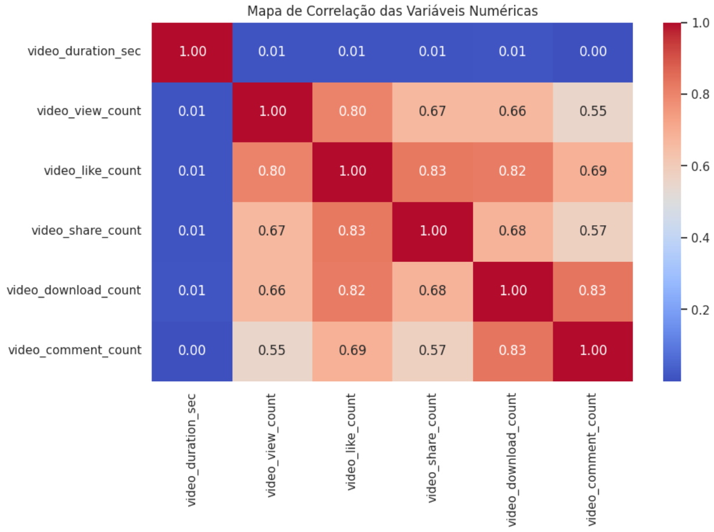
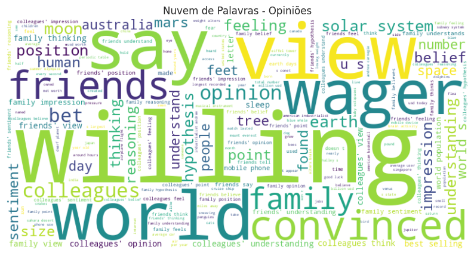
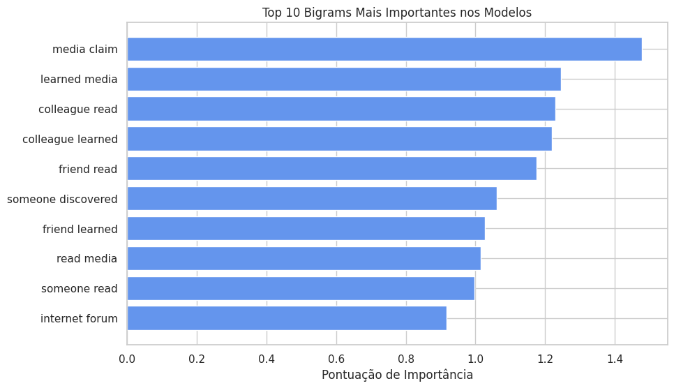
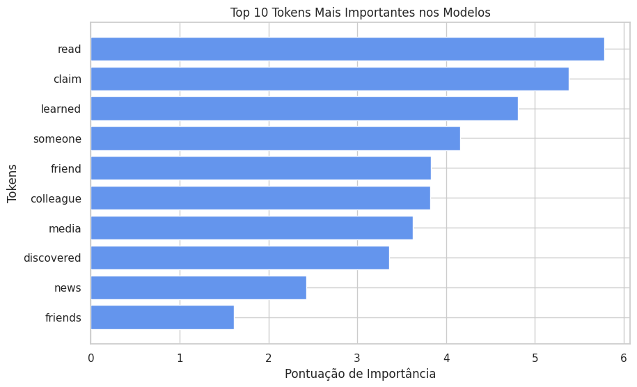

# **Modelo Preditivo para Moderação de Conteúdo: Identificação de Claims e Opiniões em Vídeos do TikTok**

### **Integrantes do Grupo**
- **Gabriella de Lima Araujo** - 2022104786  
- **Victoria Andrade Flores de Mello** - 2023002251  
- **Haniel Botelho Ribeiro** - 2023028552  

---

## **Introdução**
Este projeto tem como objetivo apoiar a moderação de conteúdo em plataformas digitais, utilizando modelos preditivos baseados em **análise de texto e aprendizado de máquina**. Analisamos um dataset de vídeos reportados do TikTok, classificando-os em duas categorias:
- **Claims** (afirmações verificáveis)
- **Opinions** (opiniões subjetivas)

Além disso, prevemos a **viralidade dos vídeos**, com foco em identificar padrões associados ao engajamento (curtidas, compartilhamentos, etc.).

**Objetivos principais:**
1. Diferenciar vídeos contendo claims e opinions para priorizar moderação de conteúdo.
2. Prever a viralidade dos vídeos com base em suas características textuais e métricas de engajamento.

---

## **Pipeline de Desenvolvimento**
O projeto foi dividido nas seguintes etapas:
1. **Exploração e limpeza do dataset**
   - Compreensão geral dos dados.
   - Tratamento de valores ausentes e identificação de padrões iniciais.
2. **Análise exploratória de dados (EDA)**
   - Análises gráficas para entender as relações entre as variáveis.
   - Correlações entre engajamento e tipo de conteúdo.
3. **Análise textual**
   - Criação de nuvens de palavras para **claims** e **opinions**.
   - Extração de padrões textuais com **TF-IDF** e **Word2Vec**.
4. **Modelagem preditiva**
   - Classificação de claims vs. opinions usando **Random Forest**.
   - Predição da viralidade com ensemble learning.
5. **Avaliação e interpretação dos modelos**
   - Métricas como **acurácia**, **F1-score**, e análise de features mais importantes.

---

## **Tecnologias Utilizadas**
- **Linguagem**: Python  
- **Bibliotecas Principais**:  
  - Pandas, NumPy, Matplotlib, Seaborn (manipulação e visualização de dados)  
  - Scikit-learn (modelagem preditiva)  
  - NLTK e WordCloud (processamento de linguagem natural)  
  - Gensim (Word2Vec para embeddings textuais)

---

## **Análises Realizadas**
### **1. Análise Exploratória**
Estatísticas iniciais revelaram que:
- Vídeos do tipo **claim** possuem maior engajamento em métricas como visualizações e compartilhamentos.  
- Contas **não verificadas** publicam mais claims, enquanto contas verificadas tendem a produzir opiniões.

**Correlação entre métricas de engajamento:**

  

---

### **2. Análise Textual**
**Nuvens de palavras para cada tipo de conteúdo:**  
- **Claims**: Destacam palavras como "discovered", "read", "media".  
- **Opinions**: Contêm termos subjetivos como "view", "world", "thought".

  
  

**Análise de bigramas mais frequentes:**  
Bigrams como **"media claim"** e **"friend discovered"** foram fundamentais para distinguir claims.  

  

---

### **3. Modelagem**
**Classificação de Claims vs. Opinions**  
O modelo **Random Forest**, utilizando representações TF-IDF e Word2Vec, alcançou:
- **Acurácia**: 99.95%  
- **F1-Score**: 1.00 (para ambas as classes)  

**Importância das features mais relevantes:**

  

**Predição de Viralidade**  
- O modelo ensemble baseado em bigramas apresentou **acurácia de 93%**.  
- Tokens e bigramas como "friend learned" foram decisivos para identificar vídeos com maior potencial de viralidade.

---

## **Resultados**
### **Classificação**
- O modelo separou com eficácia vídeos contendo **claims** (afirmações verificáveis) de vídeos com **opinions** (opiniões subjetivas), alcançando quase 100% de precisão.
- **Claims** mostraram-se mais virais que opinions, sugerindo que conteúdos factuais atraem mais engajamento.

### **Predição de Viralidade**
- Analisando padrões linguísticos e métricas de engajamento, o modelo foi capaz de prever com **93% de acurácia** se um vídeo seria viral.

---

## **Contribuições Futuras**
- Expandir o dataset com exemplos mais diversos.  
- Explorar técnicas avançadas como transformers (BERT, GPT).  
- Realizar análises longitudinais para entender como padrões de engajamento evoluem ao longo do tempo.

---

**Autores:**  
[Victoria Andrade Flores de Mello](mailto:victoriaflores@dcc.ufmg.br) | [Gabriella de Lima Araujo](mailto:email1@example.com) | [Haniel Botelho Ribeiro](mailto:haniel.botelho@example.com)

---

Sinta-se à vontade para sugerir melhorias ou abrir issues neste repositório! 🚀
