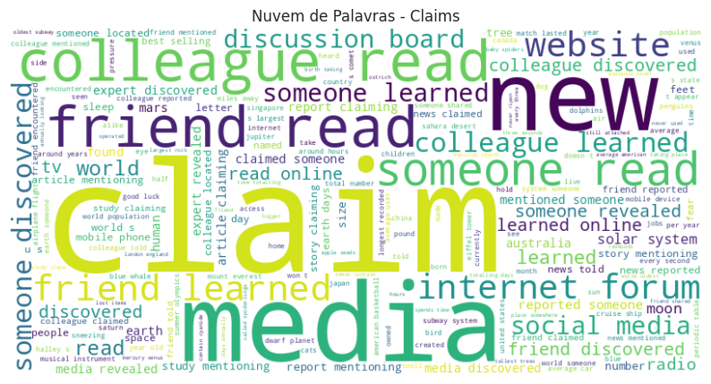
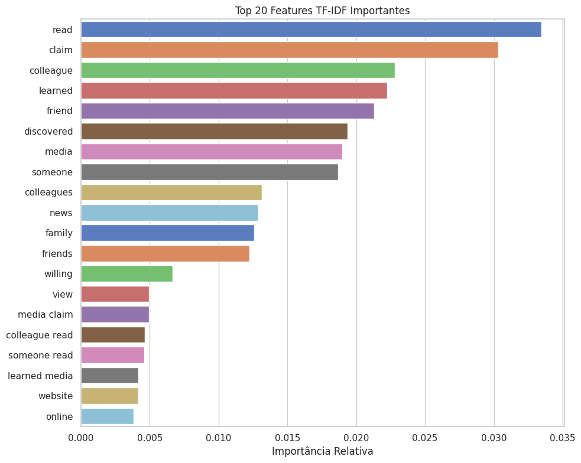

# **📱 Modelo Preditivo para Moderação de Conteúdo: Identificação de Claims e Opiniões em Vídeos do TikTok**

### **👥 Integrantes do Grupo**
- **Gabriella de Lima Araujo**  
- **Victoria Andrade Flores de Mello**  
- **Haniel Botelho Ribeiro**  

---

## **📖 Introdução**
Este projeto busca desenvolver soluções para moderar conteúdos em plataformas digitais, utilizando **técnicas de aprendizado de máquina e análise de texto**. O foco está em analisar transcrições de vídeos reportados no TikTok, classificando-os como:
- **✔️ Claims** (afirmações verificáveis)
- **💭 Opinions** (opiniões subjetivas)

Além disso, um modelo foi projetado para prever a **viralidade dos vídeos**, identificando padrões que influenciam no engajamento do público.

### **🎯 Objetivos principais**
1. Diferenciar vídeos que contêm claims de vídeos com opinions, priorizando conteúdos que demandam maior atenção na moderação.  
2. Prever a viralidade dos vídeos com base em suas características textuais e métricas de engajamento.  

---

## **⚙️ Pipeline de Desenvolvimento**
O projeto foi dividido em cinco etapas principais:

1. **🔍 Exploração e limpeza dos dados**
   - Identificação da estrutura do dataset e tratamento de dados ausentes.  
   - Seleção de variáveis relevantes.  

2. **📊 Análise exploratória de dados (EDA)**
   - Identificação de padrões entre as métricas de engajamento.  
   - Análises gráficas para explorar relações entre tipo de conteúdo e popularidade.  

3. **✍️ Análise textual**
   - Geração de nuvens de palavras e bigramas frequentes para claims e opinions.  
   - Representação textual utilizando **TF-IDF** e **Word2Vec**.  

4. **🤖 Modelagem preditiva**
   - Classificação de claims vs. opinions com **Random Forest**.  
   - Previsão de viralidade utilizando ensemble learning.  

5. **📈 Avaliação e interpretação**
   - Análise das métricas de desempenho, como **acurácia**, **F1-score** e **matriz de confusão**.  
   - Estudo das features mais importantes para os modelos.  

---

## **🛠️ Tecnologias Utilizadas**
- **💻 Linguagem de Programação:** Python  
- **📚 Principais Bibliotecas:**
  - Manipulação e visualização de dados: `Pandas`, `NumPy`, `Matplotlib`, `Seaborn`.  
  - Processamento de texto: `NLTK`, `WordCloud`, `Gensim` (Word2Vec).  
  - Modelagem preditiva: `Scikit-learn`.  

---

## **🔬 Análises Realizadas**
### **1. 🔍 Análise Exploratória**
A análise inicial revelou que vídeos do tipo **claim** têm maior engajamento nas métricas de:
- **👍 Curtidas**, **🔄 compartilhamentos**, e **👁️ visualizações**.  

Além disso, **contas não verificadas** foram as principais responsáveis por publicar claims, enquanto contas verificadas produziram mais opiniões.

#### **📊 Correlação entre métricas de engajamento**
Um heatmap destacou relações entre diferentes métricas, como curtidas e compartilhamentos.  

  

---

### **2. ✍️ Análise Textual**
**🌥️ Nuvens de palavras para claims e opinions:**  
Palavras como "discovered", "read" e "media" se destacam em claims, enquanto "view", "thought" e "world" são frequentes em opinions.

  
  

**📌 Features TF-IDF:**  
Palavras como "read", "learned" e "discovered" foram essenciais para distinguir claims de opinions.  

  

---

### **3. 🤖 Modelagem**
**✔️ Classificação de Claims vs. Opinions:**  
O modelo **Random Forest**, utilizando as representações TF-IDF e Word2Vec, atingiu:  
- **✅ Acurácia**: 99.95%  
- **📊 F1-Score**: 1.00 para ambas as classes.  

**🌟 Importância dos tokens mais relevantes:**

  

**📈 Predição de Viralidade:**  
- O modelo baseado em ensemble learning alcançou **93% de acurácia** para prever se um vídeo se tornará viral.  
- Tokens e bigramas como **"friend learned"** mostraram-se cruciais para identificar vídeos virais.  

---

## **🏆 Resultados**
### **📌 Classificação**
- O modelo separou vídeos **claims** e **opinions** com quase 100% de precisão.  
- **Claims** mostraram-se mais virais, sugerindo que conteúdos factuais geram maior engajamento.  

### **📈 Predição de Viralidade**
- O modelo foi capaz de prever com **93% de acurácia** a viralidade de vídeos analisando métricas de engajamento e padrões textuais.

---

## **🚀 Contribuições Futuras**
Para evoluir o projeto, sugerimos:  
1. **📂 Ampliar o dataset:** Incluir exemplos mais diversos para aumentar a representatividade.  
2. **🧠 Adotar transformers:** Implementar modelos como **BERT** ou **GPT** para capturar melhor as relações contextuais.  
3. **📅 Análises longitudinais:** Estudar padrões de engajamento ao longo do tempo.  
4. **🧮 Redução de dimensionalidade:** Aplicar técnicas como PCA para lidar com a alta dimensionalidade gerada por bigramas.  

---

## **🌟 Impacto do Projeto**
Este projeto contribui para a moderação de conteúdo ao:  
- **🎯 Priorizar vídeos críticos** com maior potencial viral, otimizando recursos da moderação.  
- **🛡️ Reduzir a disseminação de desinformação**, focando em conteúdos que demandam maior atenção.  
- **📊 Gerar insights valiosos** sobre padrões de engajamento e viralidade para criadores e moderadores.  

---

**👥 Autores:**  
[Gabriella de Lima Araujo](mailto:g.gabrielladelima@example.com) | [Victoria Andrade Flores de Mello](mailto:victoriaflores@example.com) | [Haniel Botelho Ribeiro](mailto:haniel.botelho@example.com)  

---

📢 **Contribuições são bem-vindas!** Sinta-se à vontade para abrir issues ou enviar sugestões de melhoria. 🚀
